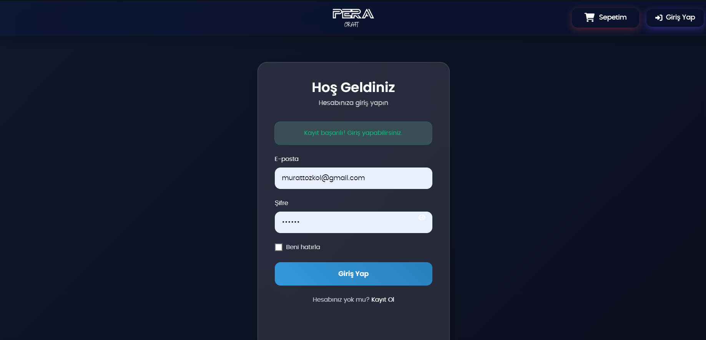
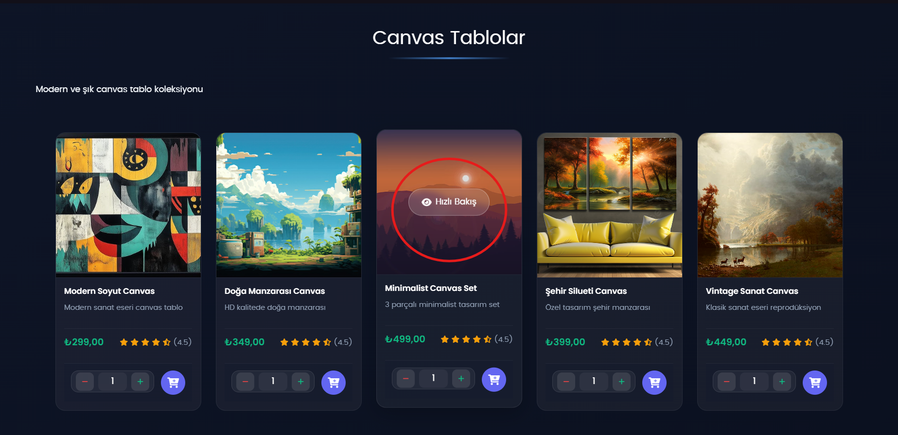
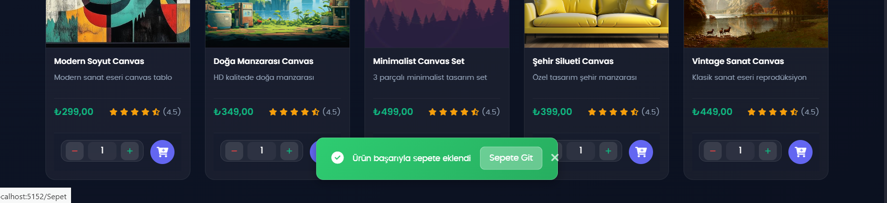
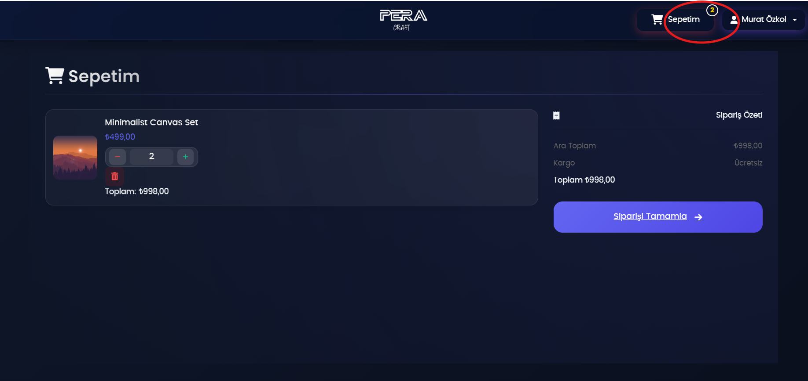
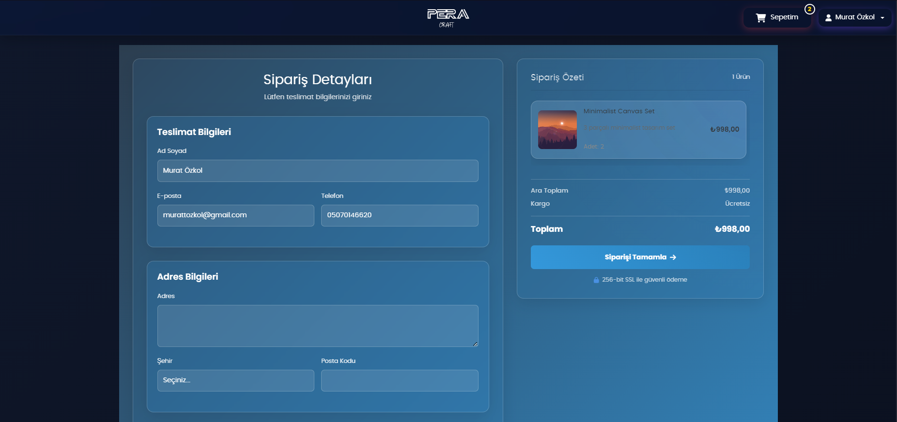
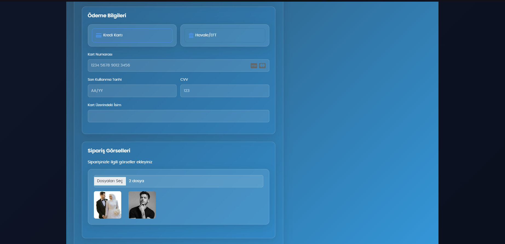
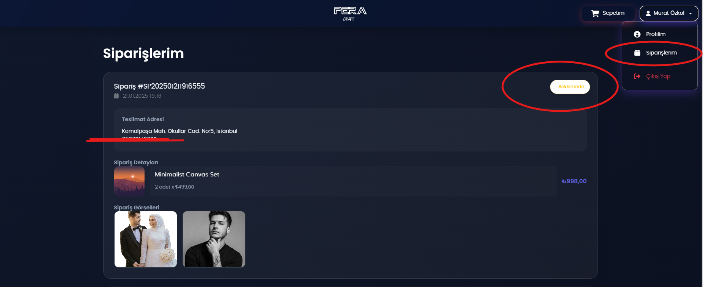
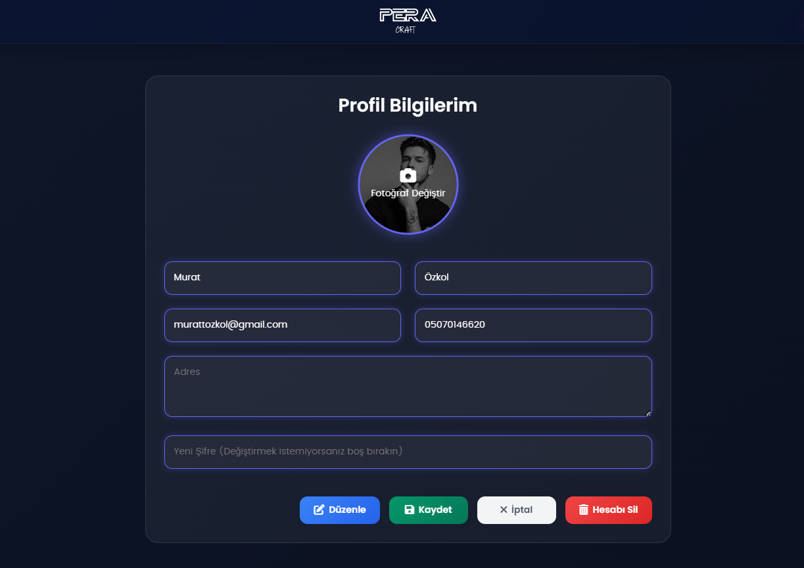
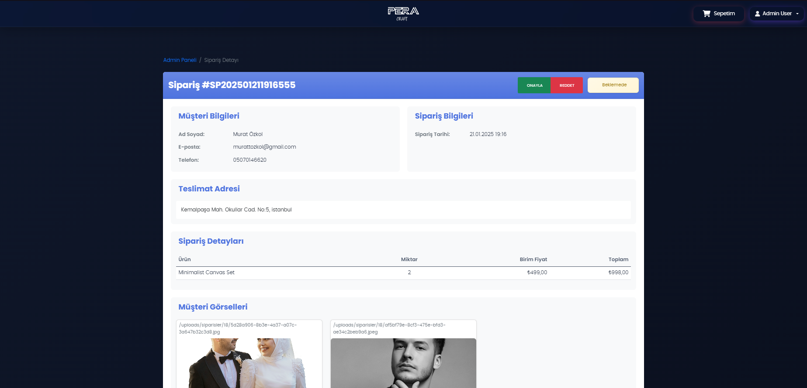
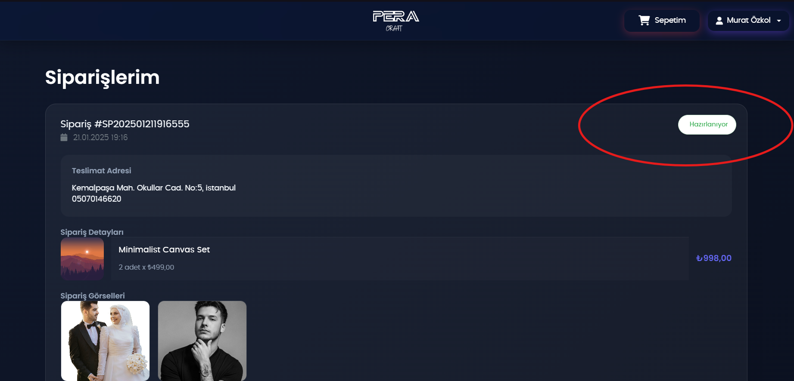

# Peracraft E-Ticaret Projesi

## 👥 Katkıda Bulunanlar
[MURAT ÖZKOL 132230111]  
[ALİ ŞEYHO 132130115]  

## 📋 Proje Özeti
Peracraft, modern web teknolojileri kullanılarak geliştirilmiş kapsamlı bir e-ticaret platformudur. Kullanıcılar için kolay ve güvenli bir alışveriş deneyimi sunarken, yöneticiler için etkili bir yönetim paneli sağlar.

---

## 🎯 Temel Özellikler

### 👤 Kullanıcı Yönetimi
- Kayıt ve Giriş Sistemi
- Profil Yönetimi
- Adres Yönetimi
- Sipariş Takibi

### 🛍️ Alışveriş Özellikleri
- Ürün Listeleme ve Filtreleme
- Sepet İşlemleri
- Sipariş Oluşturma
- Ödeme Sistemi

### 👨‍💼 Admin Paneli
- Ürün Yönetimi
- Kategori Yönetimi
- Sipariş Yönetimi
- Kullanıcı Yönetimi

---

## 🛠️ Kullanılan Teknolojiler

### Backend Teknolojileri
- **.NET 6.0**: Modern ve hızlı web uygulamaları için geliştirme platformu.
- **ASP.NET Core MVC**: Model-View-Controller mimarisi.
- **Entity Framework Core**
- **MySQL**: Veritabanı yönetim sistemi.
- **C#**: Programlama dili.

### Frontend Teknolojileri
- **HTML5/CSS3**: Sayfa yapısı ve stillendirme.
- **JavaScript/jQuery**: Dinamik kullanıcı deneyimi.
- **Bootstrap 5**: Responsive tasarım framework'ü.
- **AJAX**: Asenkron veri transferi.

---

## 🚀 Kurulum

### Gereksinimler
- .NET 6.0 SDK
- MySQL Server 8.0
- Visual Studio 2022 veya VS Code

### Veritabanı Kurulumu
1. MySQL Server'ı kurun.
2. Yeni bir veritabanı oluşturun:
   ```sql
   CREATE DATABASE peracraft_db;
   ```
3. `appsettings.json` dosyasındaki bağlantı ayarlarını güncelleyin.

### Proje Kurulumu
1. Depoyu klonlayın:
   ```bash
   git clone <depo-linki>
   cd Peracraft
   ```
2. Migration'ları uygulayın:
   ```bash
   dotnet ef database update
   ```
3. Projeyi çalıştırın:
   ```bash
   dotnet run
   ```
4. Tarayıcınızda açın:
   ```
   http://localhost:5152
   ```

---

## 📦 Proje Yapısı
- **Models**: Veri modelleri.
- **Controllers**: Uygulama mantığı.
- **Views**: Frontend şablonları.
- **Migrations**: Veritabanı migration'ları.

---

## 🌟 Özellikler ve Yetenekler
- Responsive tasarım.
- Hızlı sayfa yükleme.
- Kullanıcı dostu yönetim paneli.
- Güvenli ödeme sistemi.
- Detaylı raporlama.

---

## 📸 Proje Görselleri

### 1. Adım: Ana Sayfa

_Kullanıcıyı Parallax Efektiyle Karşılayan Modern Bir Ana Sayfa._

### 2. Adım: Kayıt ve Giriş

_Kullanıcı Sepetine Ürün Yükleyebilmek İçin Kayıt Olur ve Giriş Ekranına Yönlendirilir._

### 3. Adım: Ürün Kartları

_Ana Sayfada Ürünler Hakkında Detaylı Bilgi Alabilmesi Adına Hover Özelliği Olarak Hızlı Bakış Butonu._

### 4. Adım: Hızlı Bakış

_Hızlı Bakış Ekranında Detaylı Bilgi Aktarımı Yapılır._

### 5. Adım: Sepete Ekleme

_Müşteri İstediği Ürün Adedi Kadar Ekleme Yapabilir ve Sepete Eklediğinde Onay Bildirimi Gönderilir._

### 6. Adım: Sepet İnceleme

_Müşteri Sepetini İnceleyip Kontrol Edebilir ve Sepetim Butonundaki Badge ile Ürün Sayısını Görebilir._

### 7. Adım: Sipariş Onayı

_Kullanıcı Gerekli Bilgileri Girerek Siparişini Onaya Gönderir._

### 8. Adım: Sipariş Onayı(Devamı)

_Kullanıcı Özel Tasarım Ürünler İçin Ödeme Bilgilerini ve Fotoğraflarını Gönderir._

### 9. Adım Sipariş Durumu Kontrol

_Kullanıcı Onayladığı Siparişin Durumunu Görebilir_

### 10. Adım: Profil Yönetimi

_Kullanıcı Profil Fotoğrafı Ekleme, Şifre Değişikliği Gibi İşlemleri Yapar._

### 11. Adım: Profil Bilgileri Güncelleme

_Güncellenen Bilgiler Onaylanır._

### 12. Adım: Admin Paneli

_Admin Kullanıcılardan Gelen Tüm Siparişleri Detayları ile Birlikte Görebilir ve Onaylar._

### 13. Adım: Sipariş Süreci Takip(Müşteri Tarafı)

_Kullanıcının Siparişi Onaylandıysa Hazırlanıyor Olarak Görür, Onaylanmadıysa Reddediyor Olarak Görür._


---

## 📞 İletişim
[murattozkol@gmail.com]
[ali2003seyho@gmail.com]
